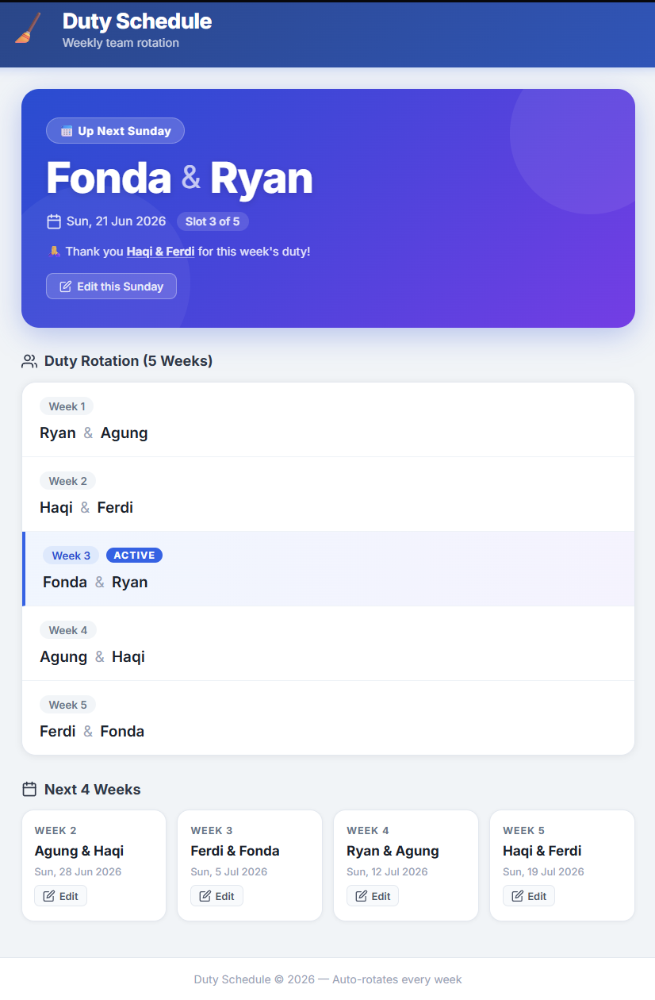

# A1312 Duty Schedule

Weekly cleaning duty rotation web app for a shared workspace, built with React and Supabase — no self-hosted backend, no server to pay for. Auto-rotates a variable-length team rotation every week; admins can rename, add, or remove teams and everyone who opens the site sees the change immediately.


## Preview



## Features

- **Auto-rotation** — displays who's on duty this Sunday, based on however many teams are currently in the rotation (not fixed at 5).
- **Hero card** — highlights the current week's pair front and center.
- **Shared, persistent edits** — renaming a team, adding a team, or removing a team writes straight to Supabase, so every visitor sees the same schedule. There is no more per-date "override" that only applied locally.
- **Add / remove teams** — grow the rotation past 5 weeks (week 6, 7, ...) or shrink it, and the weekly rotation math adjusts automatically.
- **Password-protected editing** — a modal prompts for an admin password before any edit, add, or remove is allowed.
- **Full rotation table** — shows every team with the active week highlighted.
- **Next 4 weeks view** — upcoming duty pairs.

## Tech Stack

| Layer | Stack |
|---|---|
| Frontend | React 18, Vite 5 |
| Data | Supabase (Postgres + auto-generated API), free tier |
| Deployment | Vercel (static site) |

## Project Structure

```
A1312_CleaningSchedule/
├── client/                # React + Vite frontend (the entire app)
│   ├── src/
│   │   ├── schedule.js      # rotation math (works for any team count)
│   │   ├── supabaseClient.js
│   │   ├── App.jsx          # main UI (schedule display + edit/add/remove)
│   │   └── App.css
│   └── vercel.json        # Vercel build config
└── supabase/
    └── schema.sql          # run once in Supabase's SQL Editor to set up the `teams` table
```

## Supabase Setup (one-time)

1. Create a free project at [supabase.com](https://supabase.com).
2. Open **SQL Editor → New query**, paste the contents of [`supabase/schema.sql`](supabase/schema.sql), and run it. This creates the `teams` table, sets up permissive Row Level Security policies, and seeds the original 5-team rotation.
3. Go to **Project Settings → API** and copy the **Project URL** and the **anon public** key.
4. In `client/`, copy `.env.example` to `.env` and paste those two values in.

> The anon key is meant to be public — it's fine to ship it in the frontend bundle. Access is controlled by the RLS policies on the table, not by keeping this key secret. As with the original app, the admin password is a frontend-only gate (no server-side auth) — adequate for a small team's duty schedule, not a security boundary.

## Running Locally

```sh
cd client
npm install
npm run dev          # starts on :5173 — requires client/.env (see Supabase Setup above)
```

## Deploying

Static site — point Vercel's project root at `client/`, it builds with `npm run build` and serves `dist/`. Set `VITE_SUPABASE_URL` and `VITE_SUPABASE_ANON_KEY` as Vercel environment variables (Project → Settings → Environment Variables). No other backend to deploy or pay for.

## Author

**Ryan Aric Ardhani**
